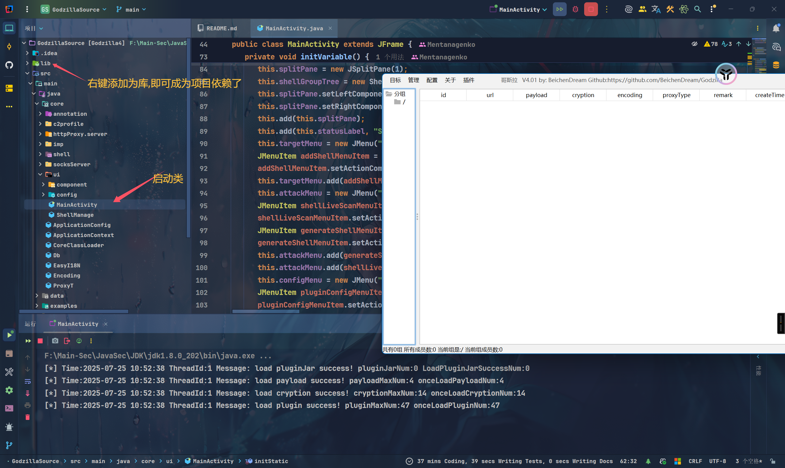

# 说明
哥斯拉4源码，开箱即用
# 使用方法
1. 将当前的lib目录设置为库,即可成为项目依赖
2. 拉取maven依赖
3. 然后到core.ui找到`MainActivity`类即可运行

# 效果
8u202下可点开即用,方便后续二开,调试,插件编写测试等等...
如果你觉得不错,star一下呗~

# 叠甲
除了对原作者的膜拜还是膜拜
本项目源码只做网络安全学习使用,未经授权的攻击是违法的,请勿用于非法用途